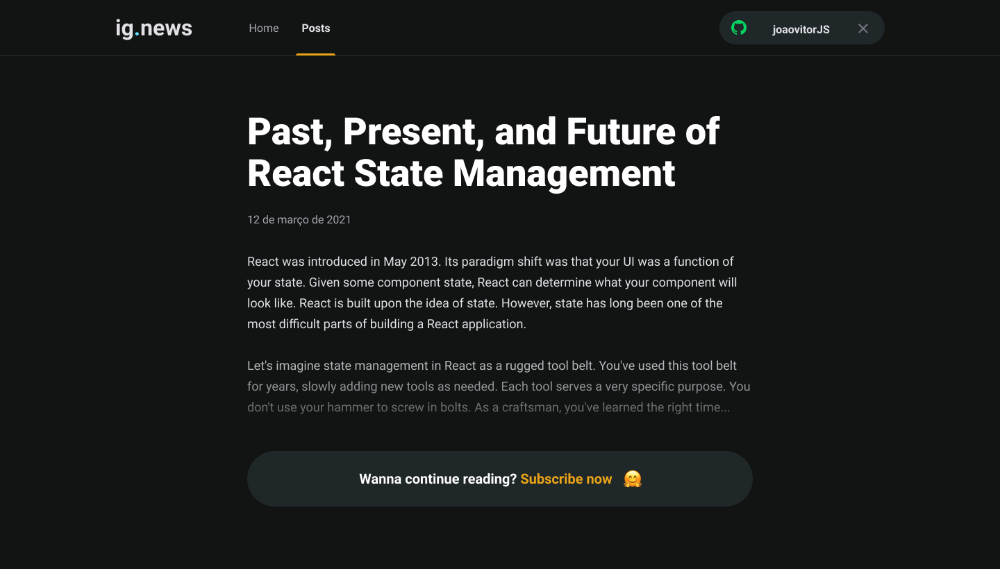

<h1 align="center">
  
</h1>

<p align="center">
  <a>
    
  </a>  
  <a>
    
  </a>
  <a>
    
  </a>
  <a href="https://lbesson.mit-license.org/" target="_blank">
    
  </a>
</p>

<h2 align="center"> 
 <strong>Ig.news</strong> | In progress 🚀 
</h2>

<p align="center">
 <a href="#-sobre-o-projeto">Sobre</a> •
 <a href="#-layout">Layout</a> • 
 <a href="#-como-executar-este-projeto">Como executar</a> • 
 <a href="#-tecnologias">Tecnologias</a> • 
 <a href="#-autor">Autor</a> • 
 <a href="#-licença">Licença</a>
</p>

## 💻 Sobre o projeto
O **Ig.news** é uma aplicação que tem como objetivos trazer post de noticias sobre React.

<p style="text-align: justify">Nesta aplicação o usuário pode se inscrever para ter acesso as notícias completas. Um detalhe é a autenticação com o Github, utilização de uma api de pagamentos chamada Stripe, Prismic CMS para servir as informações para a aplicação (conteúdo) e o FaunaDB.</p>

##### Projeto desenvolvido durante a **Treinamento Ignite - Trilha ReactJS** oferecida pela [Rocketseat](https://rocketseat.com.br/).

---
## 🎨 Layout
<br>

### Web

<!-- <p align="center">
  
</p> -->
 <br>
<p align="center">
  
  
</p>

<br>

---
## 🚀 Como executar este projeto 

### Pré-requisitos
Para executar esta aplicação, você deverá ter instalado em sua máquina as seguintes ferramentas:
* [Git](https://git-scm.com/)
* [Node.js](https://nodejs.org/en/)
* [NPM](https://www.npmjs.com/get-npm) ou [Yarn](https://yarnpkg.com/)

### 🎲 Rodando a aplicação web
```bash
# Clone este repositório -> usando SSH
$ git clone git@github.com:joaovitorJS/ignews.git

# Acesse a pasta do projeto no seu terminal
$ cd ignews

## Passos com yarn
# Instale as dependências
$ yarn

# Execute a aplicação em modo de desenvolvimento
$ yarn dev

## Passos com npm
# Instale as dependências
$ npm install

# Execute a aplicação em modo de desenvolvimento
$ npm run dev

# O servidor web inciará na porta:3000 - 
# acesse http://localhost:3000 em seu navegador para ver a aplicação funcionando
```

<br>

---
## 🛠 Tecnologias

* **[TypeScript](https://www.typescriptlang.org/)**
* **[ReactJS](https://pt-br.reactjs.org/)**
* **[NextJS](https://nextjs.org/)**
* **[Sass](https://sass-lang.com/install)**

> Veja o arquivo  [package.json](https://github.com/joaovitorJS/ignews/blob/main/package.json) para ver todas as dependências do projeto

<br>

---
## 👨🏻‍💻 Autor
<br>
<p>
  
</p>

## **[João Vitor](https://github.com/joaovitorJS)**

#### Entre em contato

<br>

<p>
  <a href="https://www.instagram.com/jaovitooor/">
  
  </a>
  &nbsp;
  <a href="https://www.linkedin.com/in/jo%C3%A3o-vitor-oliveira-85a886174/" target="_blank">
  
  </a>
  &nbsp;
  <a href="mailto:rgm38342@comp.uems.br">
  
  </a>
</p>

---

## 📝 Licença
Este projeto esta sobe a licença [MIT](https://opensource.org/licenses/MIT).
